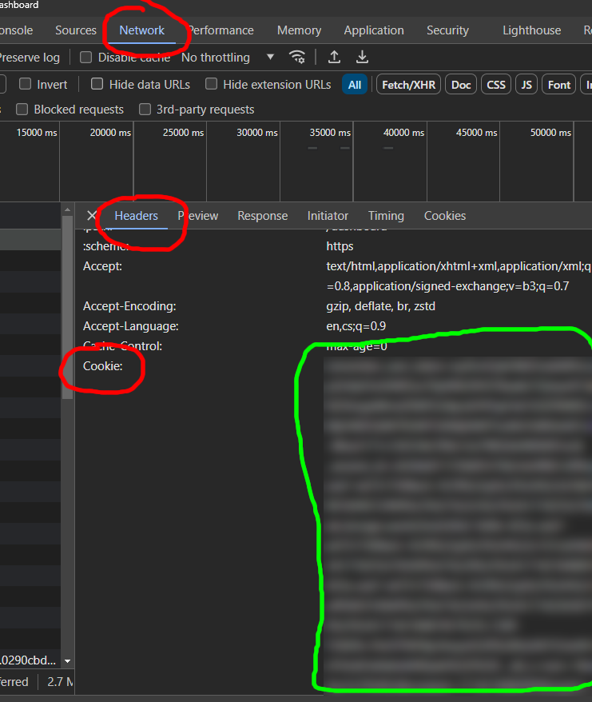

# Codewars backup

[codewars](http://codewars.com)  
Scrape your finished katas to files and upload them to a github repo.

### Local Installation

- modify the `.env_public` file with your codewars username
- create an `.env_secret` file with your codewars token

Your token may be found when inspecting the request to the corewars site after login.
You may use browser tools for that.



_contents of the file_

```txt
CW_COOKIE=...
```

clone the repository

```shell
git clone https://github.com/JakubDotPy/codewars_solutions.git 
```

`cd` into the repository

```shell
cd codewars_solutions
```

create and activate a virtual environment (Windows version)

```shell
python -m venv venv
venv/Scripts/activate
```

install requirements

```shell
pip install requirements.txt
```

run the script

```shell
python main.py
```

### Github actions

There is a prepared gihub action, that will automatically download new solutions every night.
Just set the right environment variables as repository secrets.